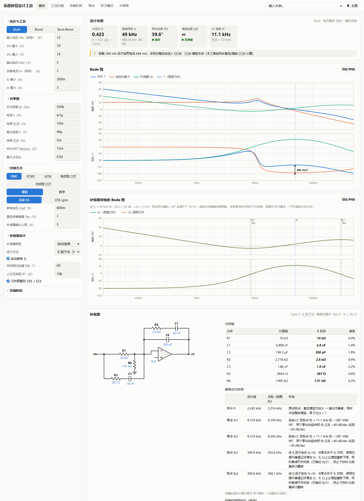
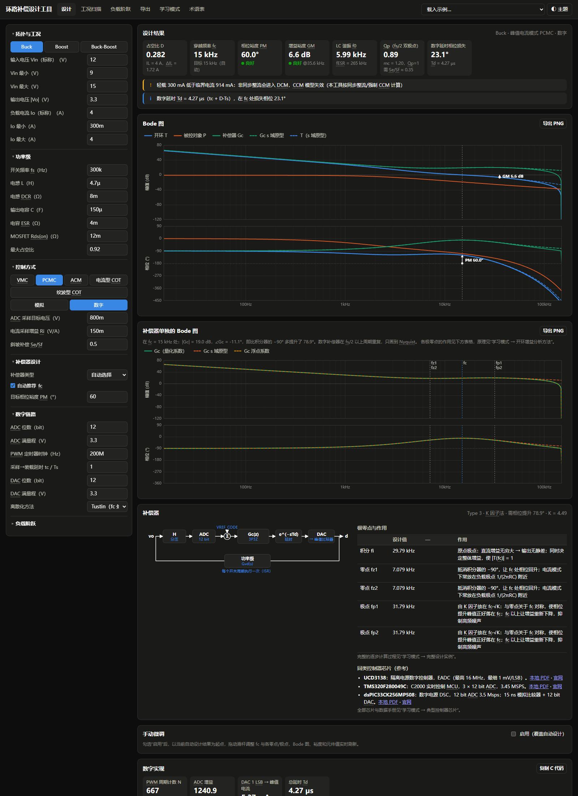
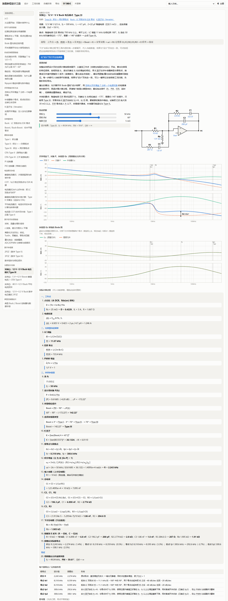
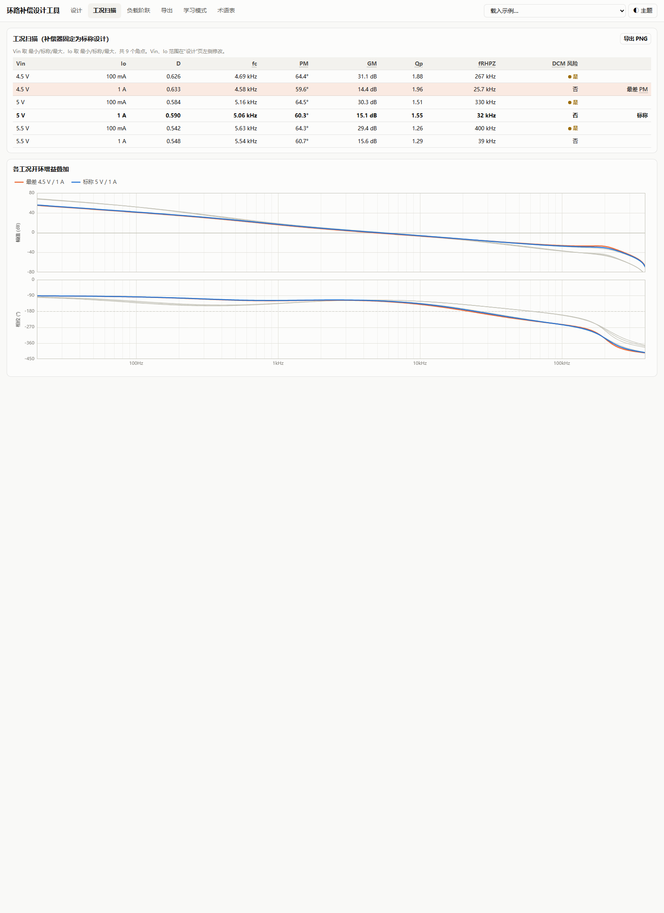
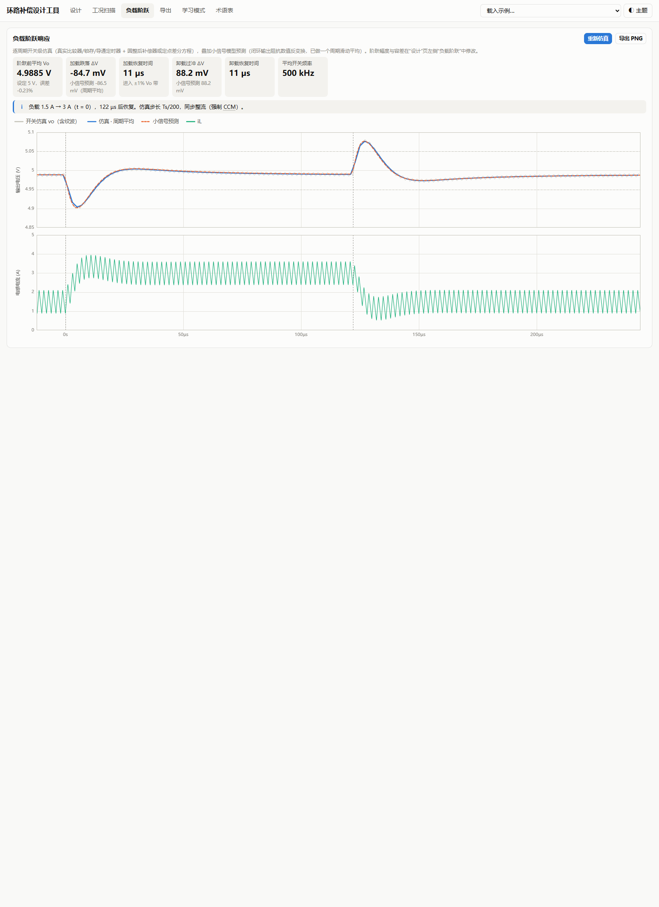

# SMPS Loop Compensation Designer

An offline tool for designing and learning feedback-loop compensation for switching power supplies (Buck / Boost / Buck-Boost). It covers voltage mode, peak/average current mode, COT and digital control, with automatic compensator design, Bode / transient analysis, and LTspice / PSIM / C-code export. It also includes an interactive course on loop compensation theory.

Everything ships as a single, dependency-free HTML file (pure JavaScript). There is also an optional Windows desktop build (pywebview + PyInstaller). The UI is in Chinese; abbreviations such as fc, PM and RHPZ are kept in English and have hover tooltips.



## Features

**Power stage (CCM averaged small-signal model)**
- Buck, Boost, inverting Buck-Boost, with inductor DCR, MOSFET Rds(on) and capacitor ESR.
- DCM boundary warning.
- Operating-point sweep over Vin × Io (min/nom/max), with fc / PM / GM per point and the worst-case phase margin highlighted.

**Control modes**
- Voltage mode (VMC)
- Peak current mode (PCMC, Ridley model with exact sampling gain He(s))
- Average current mode (ACM, inner current loop + outer voltage loop)
- Current-mode and ripple-based COT (Jian Li models, including the ESR stability criterion)

**Compensators**
- Op-amp Type I / II / III, OTA (gm) Type II / III.
- Pole/zero frequencies and RC values, rounded to E96 (R) / E24 (C). The loop is recomputed with the rounded values.
- SVG schematic with annotated component values.

**Digital compensation**
- Redesign approach: s-domain design including the digital delay, then discretization (Tustin with prewarping, or matched pole-zero).
- ADC resolution, DPWM resolution and computation delay are modelled.
- Outputs floating-point and int32 fixed-point coefficients (automatic Q format) and portable fixed-point C code with anti-windup. Quantized coefficients are re-evaluated on the Bode plot.

**Automatic design**
- Venable K-factor method with automatic Type selection and fc recommendation (fs, RHPZ and digital-delay limits).
- Classic Type III placement for VMC.
- Manual fine-tuning of poles, zeros and gain with live updates.

**Analysis**
- Bode plots of plant, compensator and loop gain, with fc / PM / GM markers and hover readout.
- Load-step transient from a cycle-by-cycle switching simulation, overlaid with the small-signal prediction (numerical inverse Laplace).

**Export**
- Design parameters as JSON (import/export), Bode plots as PNG.
- LTspice averaged-model netlist (.ac loop measurement) and switching-level transient netlist.
- PSIM parameter file and s-domain coefficients.
- C code.

**Learning mode**
- 41 interactive lessons: signals & systems basics, Laplace / z-transforms, Bode asymptotes, Nyquist, averaging, PM/GM, K-factor, RHP zero, subharmonic oscillation and slope compensation, COT, sampling / ZOH / quantization, every compensator type (Type I/II/III, OTA, PI, PID, 2P2Z/3P3Z).
- Each lesson has sliders with live Bode plots, step-by-step calculations using the current values, a table explaining the role of each pole/zero, and review questions.
- Four complete worked design examples that can be loaded into the designer.
- A reference table of 21 typical controller ICs, plus a check of the tool's formulas against the TPS54560 datasheet example.

## Screenshots

| Dark theme | Learning mode |
|---|---|
|  |  |
| Operating-point sweep | Load-step transient |
|  |  |

## Quick start

Download the HTML file (or the Windows `.exe`) from [Releases](../../releases) and open it in any modern browser. It needs no installation and no network access.

To build from source:

```bash
python build.py        # inline src/*.css and src/*.js into dist/<name>.html
python build.py exe    # also package a single-file Windows exe (requires pywebview, pyinstaller)
```

## Project layout

```
src/            JavaScript modules, CSS and the HTML template
  core.js       complex math, linear solver, E-series rounding
  model.js      DC operating point and CCM averaged small-signal model
  loops.js      modulator laws, plant and inner-loop transfer functions per control mode
  comp.js       compensators: K-factor / classic placement, RC realization
  digital.js    discretization, quantization, C code generation
  design.js     overall design pipeline
  sim.js        cycle-by-cycle switching simulation
  netlist.js    LTspice averaged netlist, PSIM, JSON export
  netsw.js      LTspice switching-level transient netlist
  learn*.js     learning-mode lessons
  ui_*.js       user interface
app.py          pywebview desktop shell (native save dialogs)
build.py        build script
test/           Node.js and Python verification scripts
```

## Tests

```bash
node test/t_math.js     # analytic checks, K-factor targets, discretization, quantization
node test/t_sim.js      # switching simulation vs small-signal prediction
node test/t_learn.js    # all lessons at default / extreme slider values
python test/t_ui.py     # headless Edge UI checks
python test/t_spice.py  # validate exported netlists with a local LTspice install
```

`t_ui.py`, `shots.py` and `t_spice.py` have hard-coded Edge and LTspice paths at the top of each file. Change them to match your machine.

## Disclaimer

This tool is for design exploration and education. Always verify a compensation design with simulation and bench measurements before using it in hardware.

## License

[MIT](LICENSE)
